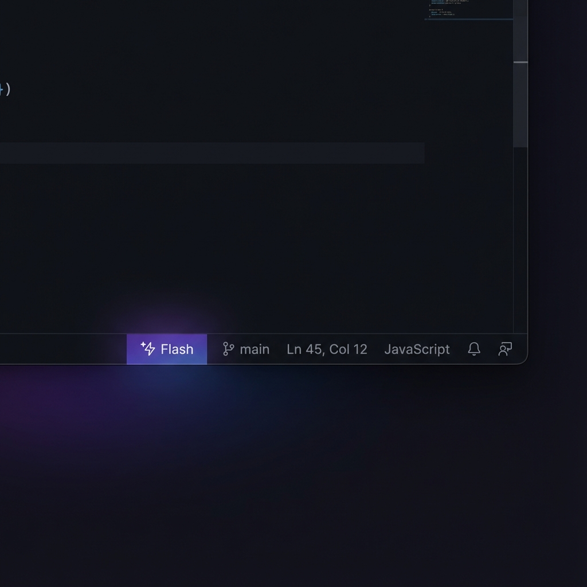

<p align="center">
  
  
  
  
  <a href="https://ko-fi.com/ai_dev_2024"></a>
</p>

<h1 align="center">🚀 Antigravity Claude Code Proxy</h1>

<p align="center">
  Based on <a href="https://github.com/badrisnarayanan/antigravity-claude-proxy">antigravity-claude-proxy</a> by Badri Narayanan S (MIT License).
</p>

<p align="center">
  <strong>Use Claude Code CLI with Gemini, GPT-5, Grok, and 20+ AI models</strong>
  <br><br>
  <em>A production-ready multi-provider AI gateway with session management and failover,<br>
  real-time status bar integration, and beautiful monitoring dashboard</em>
</p>

<p align="center">
  <a href="#-what-is-this">What is this?</a> •
  <a href="#-features">Features</a> •
  <a href="#-quick-start">Quick Start</a> •
  <a href="#-models">Models</a> •
  <a href="#-dashboard">Dashboard</a> •
  <a href="#-status-bar">Status Bar</a>
</p>

---

## 📖 What is this?

**Antigravity Claude Proxy** is a local proxy server that enables **Claude Code CLI** to use multiple AI providers:

| Without Proxy | With Proxy |
|--------------|------------|
| Only Claude models | **20+ AI models** (Gemini, GPT-5, Grok, Claude, etc.) |
| Manual session handling | **Managed sessions with automatic failover** |
| No monitoring | **Real-time dashboard** |
| No status | **Status bar integration** |

### How it Works

```
┌─────────────────┐      ┌──────────────────────┐      ┌─────────────────────┐
│                 │      │                      │      │                     │
│  Claude Code    │─────▶│  Antigravity Proxy   │─────▶│  Google AI (Gemini) │
│  CLI/Extension  │      │  localhost:8080      │      │  + Perplexity       │
│                 │      │                      │      │  + More providers   │
└─────────────────┘      └──────────────────────┘      └─────────────────────┘
```

---

## 🖼️ Showcase

<p align="center">
  
  <br>
  <em>Real-time dashboard with session health and usage stats</em>
</p>

<p align="center">
  
  <br>
  <em>Live model indicator in your IDE status bar (⚡ Flash, 💎 Pro, 🎭 Opus)</em>
</p>

---

## ✨ Features

### 🎯 Core Capabilities

| Feature | Description |
|---------|-------------|
| **Multi-Provider Access** | Use Gemini, GPT-5, Grok, Claude, Kimi, and more through one API |
| **Session Management** | Tracks signed-in sessions, keeps requests on a stable session and fails over when one is unavailable |
| **Status Bar Integration** | See current model with emoji icons (⚡💎🎭🎵) |
| **Beautiful Dashboard** | Monitor accounts, usage, and switch models at `localhost:8080` |
| **Auto-Start** | Proxy starts automatically when you open your IDE |
| **Model Persistence** | Your selected model survives restarts |

### 🧠 Smart Features

- **🔄 Smart Routing**: Extension dropdown Opus/Haiku/Default pass-through, Custom uses dashboard
- **⚡ Agentic Fallback**: Chat-only models auto-switch to agentic models for file operations
- **📊 Usage Tracking**: Per-model and per-account statistics
- **🛡️ Reliability**: Retries with backoff and routes around unavailable sessions

---

## 🚀 Quick Start

### Prerequisites

- **Node.js** 18+ 
- **Antigravity** desktop app ([Download](https://antigravity.dev))
- **Claude Code CLI** (`npm install -g @anthropic-ai/claude-code`)

### Installation

```bash
# Clone the repository
git clone https://github.com/ai-dev-2024/Antigravity-Claude-Code-Proxy.git
cd Antigravity-Claude-Code-Proxy/Antigravity-Claude-Code-Proxy

# Install dependencies
npm install

# Create your .env and set GOOGLE_OAUTH_CLIENT_SECRET (required for Google login)
cp .env.example .env

# Start the proxy
npm start
```

> **Required:** the proxy no longer ships a Google OAuth client secret. Set `GOOGLE_OAUTH_CLIENT_SECRET` in `.env` (or your environment) to the secret for the OAuth client ID you use. Without it, adding accounts and refreshing tokens fail with a clear error. See `.env.example`.

### Configure Environment

**Windows (PowerShell):**
```powershell
[Environment]::SetEnvironmentVariable("ANTHROPIC_BASE_URL", "http://localhost:8080", "User")
[Environment]::SetEnvironmentVariable("ANTHROPIC_API_KEY", "antigravity-proxy", "User")
```

**macOS/Linux:**
```bash
echo 'export ANTHROPIC_BASE_URL="http://localhost:8080"' >> ~/.bashrc
echo 'export ANTHROPIC_API_KEY="antigravity-proxy"' >> ~/.bashrc
source ~/.bashrc
```

### Start Using!

```bash
claude
```

---

## 🤖 Models

### ⚡ Agentic Models (Full Capabilities)

| Model | Alias | Best For |
|-------|-------|----------|
| `gemini-3-flash` | `flash` | Fast tasks, simple commands |
| `gemini-3-pro-high` | `pro` | Complex coding, deep analysis |
| `claude-opus-4-5-thinking` | `opus` | Complex reasoning |
| `claude-sonnet-4-5-thinking` | `sonnet` | Balanced performance |

### 🔍 Search Models (Chat + Web Search)

| Model | Provider | Description |
|-------|----------|-------------|
| `pplx-grok` | Perplexity | Grok 4.1 with web search |
| `pplx-gpt51` | Perplexity | GPT-5.1 chat |
| `pplx-kimi` | Perplexity | Kimi (Moonshot) |
| `sonar` | Perplexity | Web search focused |

### Model Switching

```bash
# In Claude Code chat:
/model flash        # Switch to Gemini 3 Flash
/model pro          # Switch to Gemini 3 Pro
/model grok         # Switch to Grok (Perplexity)

# Or use dashboard:
# Open http://localhost:8080/dashboard
```

---

## 📊 Dashboard

Access the dashboard at **http://localhost:8080/dashboard**

Features:
- **Account Monitor**: See all accounts, their status, and remaining quota
- **Model Switcher**: Quick dropdown to change active model
- **Usage Statistics**: Track requests per model
- **Health Status**: See which sessions are healthy or need attention

---

## 📊 Status Bar (v2.0+)

The status bar extension shows your current model in real-time:

| Icon | Model |
|------|-------|
| ⚡ | Gemini Flash |
| 💎 | Gemini Pro |
| 🎭 | Claude Opus |
| 🎵 | Claude Sonnet |
| 🌐 | Grok |
| 🔍 | Perplexity/Sonar |

**Features:**
- Updates every 2 seconds
- Click to open dashboard
- Notification on model change

---

## 🔌 API Reference

| Endpoint | Method | Description |
|----------|--------|-------------|
| `/v1/messages` | POST | Anthropic Messages API |
| `/v1/models` | GET | List available models |
| `/active-model` | GET/POST/DELETE | Model override control |
| `/dashboard` | GET | Web dashboard |
| `/health` | GET | Health check |
| `/account-limits` | GET | Account quotas |

---

## 📁 Project Structure

```
Antigravity-Claude-Code-Proxy/
├── src/
│   ├── server.js          # Main Express server
│   ├── account-manager.js # Multi-account handling
│   ├── constants.js       # Model aliases & config
│   └── public/
│       └── dashboard.html # Web dashboard
├── docs/
│   └── images/            # Showcase images
├── SECURITY.md            # Security policy
├── CHANGELOG.md           # Version history
└── package.json           # v2.5.0
```

---

## 🔒 Security

- **No credentials in code**: All sensitive data stored locally
- **Comprehensive .gitignore**: Accounts, tokens, logs excluded
- **npm audit**: 0 vulnerabilities
- **Local-only**: Runs on localhost by default

See [SECURITY.md](SECURITY.md) for full security policy.

---

## 📋 Version History

| Version | Type | Features |
|---------|------|----------|
| **v2.5** | Extension | IDE account switcher, simplified layout |
| **v2.4** | Extension | Direct OAuth, multi-state auth server |
| **v2.3** | Extension | Per-window models, dark theme dashboard |
| **v2.2** | Extension | PM2 process manager, Material Design |
| **v2.1** | Extension | Robust model routing, faster polling |
| **v2.0** | Extension | Status bar extension, model mapping |
| **v1.2** | CLI | Smart routing, model persistence |
| **v1.1** | CLI | Multi-account, Perplexity, dashboard |
| **v1.0** | CLI | Initial release |

See [CHANGELOG.md](CHANGELOG.md) for detailed history.

---

## 📜 License

MIT License - See [LICENSE](LICENSE) for details.

This project is built on [antigravity-claude-proxy](https://github.com/badrisnarayanan/antigravity-claude-proxy) by Badri Narayanan S, used under the MIT License. The original copyright notice is kept in [LICENSE](LICENSE).

---

<p align="center">
  <strong>Made with ❤️ for the Claude Code community</strong>
  <br>
  <a href="https://github.com/ai-dev-2024/Antigravity-Claude-Code-Proxy/issues">Report Bug</a> •
  <a href="https://github.com/ai-dev-2024/Antigravity-Claude-Code-Proxy/issues">Request Feature</a>
</p>

<br>

<h2 align="center">❤️ Support This Project</h2>

<p align="center">
  If you find this project helpful, please consider buying me a coffee! Your support helps keep the updates coming.
</p>

<p align="center">
  <a href="https://ko-fi.com/ai_dev_2024">
    
  </a>
</p>
